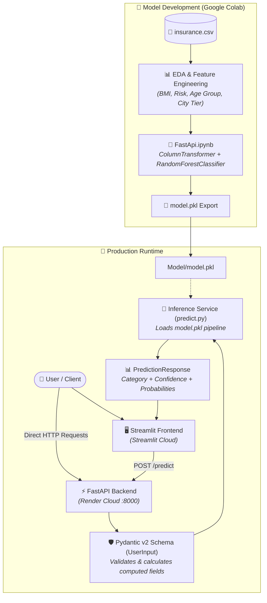

# 🏥 Insurance Premium Category Prediction API & Web App

[](https://fastapi-insurance-premium-prediction-04.streamlit.app)
[](https://fastapi.tiangolo.com/)
[](https://render.com)
[](https://www.python.org/)

An end-to-end Machine Learning web service and interactive UI for predicting health insurance premium categories, built with **FastAPI**, **Pydantic v2**, **Scikit-Learn**, **Streamlit**, and **Docker**, with model training conducted in **Google Colab** and cloud deployment on **Render** and **Streamlit Cloud**.

The system ingests raw applicant demographic, physiological, lifestyle, and economic attributes, applies automatic feature engineering (BMI, lifestyle risk, age brackets, city tier classification), and outputs the predicted premium category along with class confidence distributions.

---

## 🌐 Live Deployments & Demo

| Service | Environment | URL | Status |
| :--- | :--- | :--- | :--- |
| **Streamlit Web App** | Streamlit Cloud | [fastapi-insurance-premium-prediction-04.streamlit.app](https://fastapi-insurance-premium-prediction-04.streamlit.app) | 🟢 Live |
| **FastAPI Backend API** | Render Cloud | [fastapi-insurance-premium-prediction.onrender.com](https://fastapi-insurance-premium-prediction.onrender.com) | 🟢 Live |
| **Interactive API Docs** | Render Cloud | [fastapi-insurance-premium-prediction.onrender.com/docs](https://fastapi-insurance-premium-prediction.onrender.com/docs) | 🟢 Live |

---

## 🌟 Key Features

- ⚡ **High-Performance REST API**: Powered by **FastAPI** with automatic Swagger UI (`/docs`) and ReDoc (`/redoc`) API documentation.
- 🛡️ **Robust Validation & Dynamic Feature Engineering**: Built using **Pydantic v2** with:
  - `@field_validator`: Cleans and normalizes text inputs (e.g., standardizing city names to Title Case).
  - `@computed_field` attributes:
    - **`bmi`**: Body Mass Index computed automatically from `height` and `weight`.
    - **`lifestyle_risk`**: Evaluated as `low`, `medium`, or `high` based on smoking habits and BMI thresholds.
    - **`age_group`**: Segmented into `young` (<25), `adult` (25–44), `middle_aged` (45–59), or `senior` (60+).
    - **`city_tier`**: Automatically mapped to Tier 1, Tier 2, or Tier 3 using geographical reference lists.
- 🌲 **Trained Machine Learning Pipeline**: Includes the full training notebook (`FastApi.ipynb`) training a **RandomForestClassifier** with `ColumnTransformer` (OneHotEncoding on categorical variables, passthrough for numerical features).
- 🎯 **Probabilistic Classification Output**: Returns the predicted premium tier, maximum confidence score, and probability distribution across all categories.
- 🖥️ **Interactive Streamlit Frontend**: User-friendly web form connecting either to a local FastAPI server or live deployed cloud instances on **Render**.
- 🐳 **Production Dockerized**: Multi-stage ready `Dockerfile` based on `python:3.11-slim` for containerized cloud deployment (Render, AWS EC2, GCP, etc.).

---

## 🏗️ Architecture & Workflow



---

## 📂 Repository Structure

```plaintext
FastAPI-insurance-premium-prediction/
├── app.py                      # ⚡ FastAPI application exposing /, /health, and /predict
├── frontend.py                 # 🖥️ Streamlit interactive web dashboard (configured for Render / local)
├── FastApi.ipynb               # 📓 Google Colab training notebook: EDA, feature engineering & model training
│
├── Model/
│   ├── model.pkl               # 📦 Serialized Scikit-Learn RandomForest classification pipeline
│   └── predict.py              # 🧠 Model loader, versioning, and prediction inference logic
│
├── schema/
│   ├── user_input.py           # 🛡️ Pydantic schema with computed feature engineering & validation
│   ├── prediction_response.py  # 📊 Pydantic schema for structured prediction response
│   └── config/
│       └── city_tier.py        # 🗺️ Reference configuration for Tier 1 and Tier 2 cities
│
├── Dockerfile                  # 🐳 Docker configuration for containerized deployment
├── requirements.txt            # 📦 Reorganized and cleaned Python dependencies
└── README.md                   # 📖 Project documentation
```

---

## ⚙️ Prerequisites & Installation

### 1. Clone the Repository
```bash
git clone git@github.com:joel799659/FastAPI-insurance-premium-prediction.git
cd FastAPI-insurance-premium-prediction
```

### 2. Create and Activate a Python 3.11 Virtual Environment
```bash
python3.11 -m venv myenv
source myenv/bin/activate   # On Windows: myenv\Scripts\activate
```

### 3. Install Dependencies
```bash
pip install -r requirements.txt
```

---

## 🚀 Running the Project Locally

### 1. Start the FastAPI Backend Server Locally
Run the API using `uvicorn`:

```bash
uvicorn app:app --host 127.0.0.1 --port 8000 --reload
```

- **API Base URL**: `http://127.0.0.1:8000`
- **Interactive Swagger Docs**: `http://127.0.0.1:8000/docs`
- **Alternative ReDoc UI**: `http://127.0.0.1:8000/redoc`

---

### 2. Launch the Streamlit Frontend Web App
In a separate terminal window:

```bash
streamlit run frontend.py
```

Open your browser at `http://localhost:8501` to test predictions interactively.

> [!NOTE]
> In [`frontend.py`](frontend.py), the `API_URL` can be toggled between:
> - **Render Live Cloud Server**: `https://fastapi-insurance-premium-prediction.onrender.com/predict`
> - **Local Server**: `http://127.0.0.1:8000/predict`

---

## 🔌 API Endpoints Reference

### 1. Welcome / Root
- **Method**: `GET /`
- **Description**: Basic human-readable status check.
- **Response**:
```json
{
  "message": "Insurance Premium Prediction API"
}
```

### 2. Health Check
- **Method**: `GET /health`
- **Description**: Machine-readable service and model availability status.
- **Response**:
```json
{
  "status": "OK",
  "version": "1.0.0",
  "model_loaded": true
}
```

### 3. Predict Premium Category
- **Method**: `POST /predict`
- **Headers**: `Content-Type: application/json`
- **Request Body Example**:
```json
{
  "age": 32,
  "weight": 72.5,
  "height": 1.75,
  "income_lpa": 12.0,
  "smoker": false,
  "city": "Bangalore",
  "occupation": "private_job"
}
```
- **Response Example**:
```json
{
  "response": {
    "predicted_category": "Medium",
    "confidence": 0.8124,
    "class_probabilities": {
      "Low": 0.1245,
      "Medium": 0.8124,
      "High": 0.0631
    }
  }
}
```

---

## 🐳 Docker Deployment

To build and run the service inside a Docker container:

### 1. Build the Docker Image
```bash
docker build -t insurance-premium-api .
```

### 2. Run the Container
```bash
docker run -d -p 8000:8000 --name premium-api insurance-premium-api
```

The API will now be accessible at `http://localhost:8000` (and `http://localhost:8000/docs`).

---

## ☁️ Cloud Deployment

- **Frontend (Streamlit Cloud)**: Continuously deployed from the `main` branch to [Streamlit Community Cloud](https://fastapi-insurance-premium-prediction-04.streamlit.app).
- **Backend (Render Web Service)**:
  - **Build Command**: `pip install -r requirements.txt`
  - **Start Command**: `uvicorn app:app --host 0.0.0.0 --port $PORT`
  - **Live URL**: `https://fastapi-insurance-premium-prediction.onrender.com`

---

## 🛠️ Tech Stack

| Component | Technology | Description |
| :--- | :--- | :--- |
| **Model Development** | [Google Colab](https://colab.research.google.com/) | Interactive cloud environment for training and experimentation |
| **Machine Learning** | [Scikit-Learn](https://scikit-learn.org/) | Preprocessing pipeline with `ColumnTransformer` & `RandomForestClassifier` |
| **API Framework** | [FastAPI](https://fastapi.tiangolo.com/) | High-performance asynchronous web framework |
| **Server** | [Uvicorn](https://www.uvicorn.org/) | Lightning-fast ASGI web server |
| **Data Validation** | [Pydantic v2](https://docs.pydantic.dev/) | Parsing, validation, and automated feature engineering |
| **Data Manipulation** | [Pandas](https://pandas.pydata.org/) | DataFrame transformations for tabular ML inference |
| **Web Frontend** | [Streamlit](https://streamlit.io/) | Interactive UI for real-time model interaction |
| **Containerization** | [Docker](https://www.docker.com/) | Containerized deployment environment |
| **Cloud Hosting** | [Render](https://render.com/) & [Streamlit Cloud](https://streamlit.io/cloud) | Hosting for API and user interface |

---

## 📄 License

This project is licensed under the [MIT License](LICENSE).